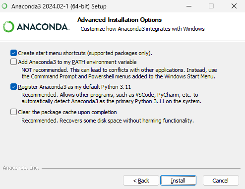
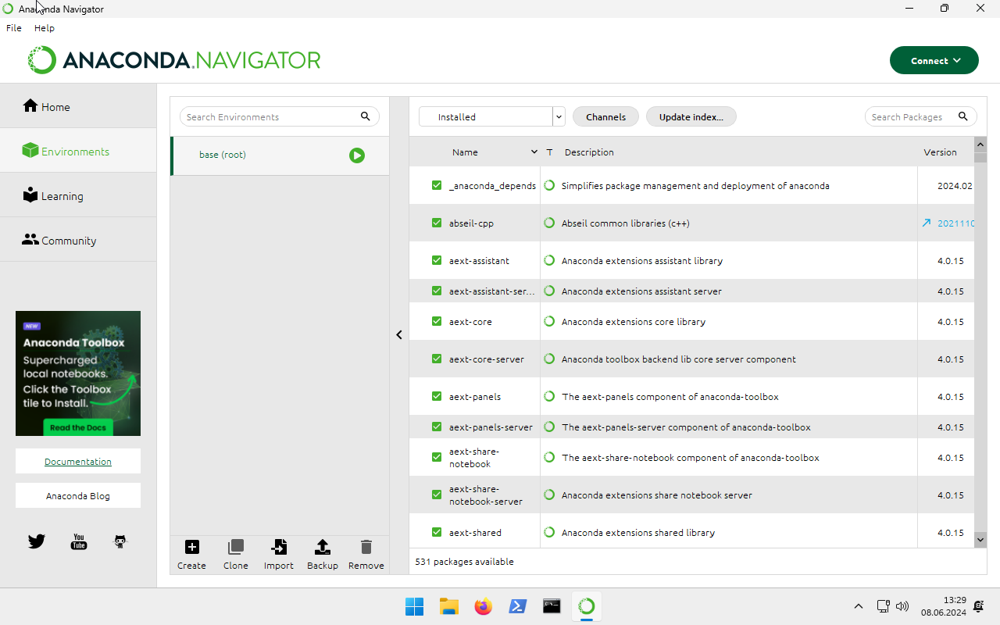
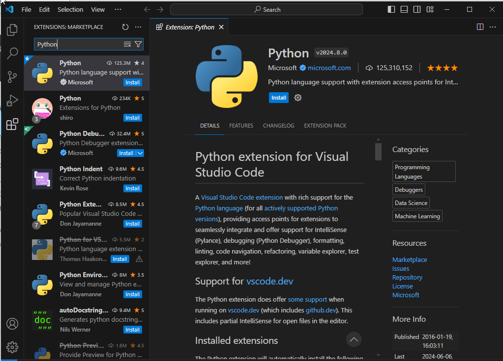

# Preparations

## Anaconda Setup

oTree uses the programming language Python to set up the logic of the experiment. Instead of just installing Python and starting to programm, I would advise you to use anaconda. anaconda is a program that manages multiple Python environments, so different experiments that use different versions of oTree (and Python) can live in separate folders.

Download and install anaconda from this link: https://www.anaconda.com/download/success. Install it just for you, so you don't need admin privileges. Register Anaconda as default Python when asked, but don't add it to PATH. 

The Anaconda Navigator app is helpful because it shows you a graphical list of all environments that you have installed. Since each environment comes with its own Python install, if you have many environments installed, it may take up a lot of space. You can use the app's "Environments" option on the left to manually delete any environments that you don't need anymore. 

## Choosing an IDE

In principle, you could use a generic notepad app on your PC to program an experiment, but an integrated development environment (IDE) makes life much easier by providing debugging and management tools. Personally, I use Microsoft Visual Studio Code these days. It's a lightweight editor that supports pretty much anything and has a lot of useful, free addons. Download it by following this link. Again, it's possible to install it without WZB admin privileges. Alternatively, you could take a look at PyCharm. 

https://code.visualstudio.com/Download

After starting VS Code for the first time, click on the Extensions icon on the left, search and install the "Python" extension by Microsoft. This extension lets VS Code "understand" Python.

