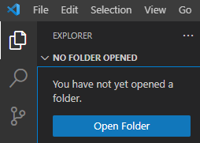
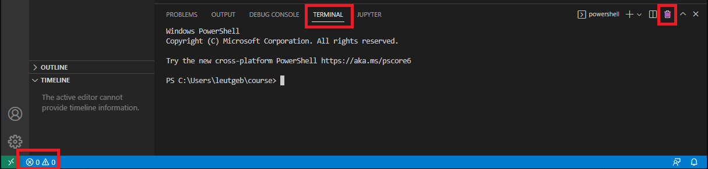

# Setting up an oTree Project

## Introduction

oTree is an open source, free software for running experiments published under the MIT open source licence. That means that if you use oTree for an experiment you have to cite their paper.

    Daniel L. Chen, Martin Schonger, Chris Wickens, oTree—An open-source platform for laboratory, online, and field experiments, Journal of Behavioral and Experimental Finance, Volume 9, 2016, Pages 88-97, ISSN 2214-6350, https://doi.org/10.1016/j.jbef.2015.12.001.

oTree can be used as a general setup for everything like laboratory, lab-in-the-field, lab-online or MTurk/Prolific studies. Some PC/server is configured as an oTree server. The server interface can be accessed via a browser to create sessions and generate links for clients. Clients then access the server and interact with the experimental environment via a regular web browser. oTree handles all connections between the clients and the server. 

The logic of the experimental environment is programmed in Python, while the websites that the subjects interact with are regular html websites. You don't actually have to set up the entire website yourself, oTree does most of the heavy lifting for you. Some basic html knowledge is required though, and if you want to set up a more fancy experiment, you should know javascript. 

## oTree or oTree Hub

In this course I will focus on programming an oTree experiment on your local computer. The creators of oTree also offer oTree Hub, a graphical interface to make setting up experiments easier (and also giving you the option to easily running experiments with online servers from server company Heroku). I believe that oTree Hub can be useful when starting with oTree, but there are limitations to what you can achieve. Also I think understanding how the code works is very important. Still, you can check it out at https://www.otreehub.com/.

## Resources

Check out the oTree website for a general overview. http://www.otree.org

The most helpful resource is the documentation. It covers all functions that oTree offers. https://otree.readthedocs.io/en/latest/index.html

If you have problems with your code, consider checking out this google group. Sometimes people had the same problem as you. https://groups.google.com/g/otree

The google group sees less activity these days and seems to be superceded by a new forum. https://www.otreehub.com/forum/

Also, many programmers/researchers make their code available on github. So instead of implementing some task yourself you can search for already implemented versions. https://github.com/search?q=otree

## Creating a Project Folder

Open VS Code, select Explorer icon on the left and click on Open Folder. Now choose the folder where you will save your project. I usually create a folder projects in my personal folder and create a folder for each project. This project goes to

    C:\Users\Johannes\projects\course

but anywhere goes. When asked whether you trust the authors of the files in this folder, click Yes I trust the authors.

## Setting up an Environnment

Open the Command Palette by clicking View -> Command Palette (or by pressing Ctrl + Shift + P). Type "Python: Create Environment..." and hit enter. 

When asked whether you want to use conda or venv, click on conda. 

Finally, it will ask you which Python version you want to install. As of version 5.10, oTree supports Python 3.11, so select it. You can check which Python version is supported in the official changelog. https://otree.readthedocs.io/en/latest/misc/version_history.html

Now it will install an environment exclusive to this experiment. 

## Installing oTree

Click the second button in the bottom left and select "Terminal". Through this terminal you have direct access to Terminal/Powershell. 

Now we can install the oTree package. Enter

    pip install --upgrade otree

which will grab the newest version of the otree package (5.10.4 when I am writing this) and all the packages that it depends on. After installing it, type 

    pip show otree

to get the version of otree that was installed. Next, tell oTree to create a project folder called "oTree". Type

    otree startproject oTree

When asked whether you want to include the sample games, type y and press Enter. oTree ships with some pre-programmed examples that can be handy to have a look at when starting out. We will be working in our project folder, so type

    cd oTree

and hit enter. To test whether the oTree package is running smoothly, type

    otree devserver

oTree will start a local development server that is useful to test experiment. You can access it by opening the link http://localhost:8000. If the terminal says "otree has been updated. Please delete your database (db.sqlite3)", open the oTree folder on the left and delete the database file. 

To kill the server, return to VS Code and press Ctrl-C.

Finally, we should document which versions of Python and oTree we programmed our experiment with. I like to create a new file called README.md. Right-click on the oTree folder in the Explorer tab and select New File. Document the current Python and oTree versions that we used. If you are unsure, type

    pip show otree

and 

    python --version

in the terminal.

Finally, you need to add one thing in your oTree folder: Create a file called runtime.txt in your main oTree folder. This txt will tell the server provider heroku which Python version it should use. First, check the Python version that you are using

    python --version

Note down the Python version and create runtime.txt in the main oTree folder. My Python version is 3.11.9 so I write

    python-3.11.9
