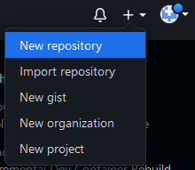
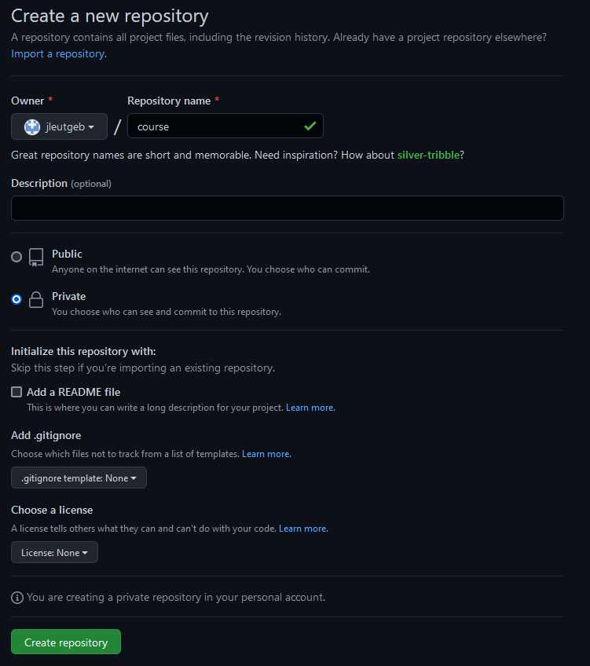
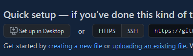
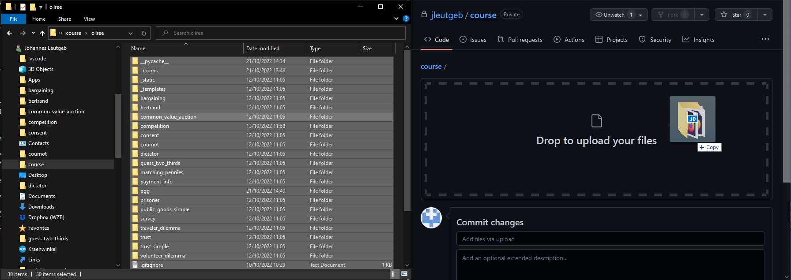
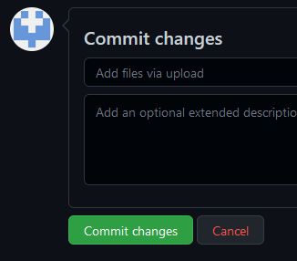
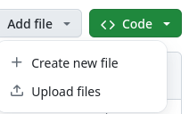
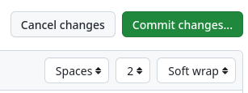
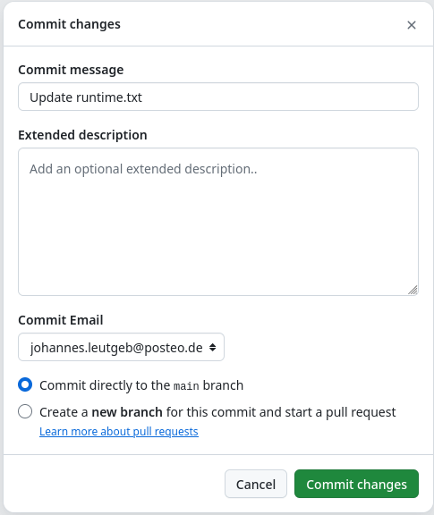

# Using Github

## Publishing Code on Github

I won't cover the basics of version control using git and github here. I will show you how to manually push your final code to a github project. Go to github.com and login (or register). After you log in look in the top right corner and click the little plus sign. Select New repository.

On the next page, give your repository a name. I'll use course. Decide whether you want your code to be public or private. Then, click Create repository. 

On the next page locate the option "uploading an existing file" (in the section Quick setup).

Navigate to your oTree folder on your computer and select all files and folders. Drag and drop them onto the box in the browser.

After the upload is done, scroll down to the bottom of the screen and click Commit changes.

Now your code is available on github!

## Updating Code on Github

Sometimes you will change some code in your project and you have to update your code on github. There are two options. 

### The consistent way

Make any changes in your project on your computer. Got to your project in your browser and click on "Add file". 

Now you can drag and drop your files like in the first step. You can just upload the files that you changed, or you can upload the entire folder again. The latter is probably safer. 

### The quick and dirty way

If you have to make a very quick change ad hoc, you can also make changes to individual files in the github project First, you manually open a file in your github project, click on the edit button (the little pencil icon in the top right) and make the changes you want. 

Afterwards, click on Commit changes in the top right corner

and confirm the changes by clicking on Commit changes in the windows that opens up. 

