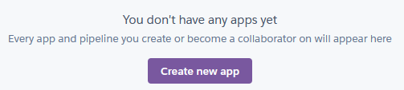
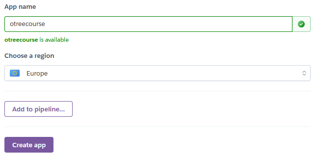
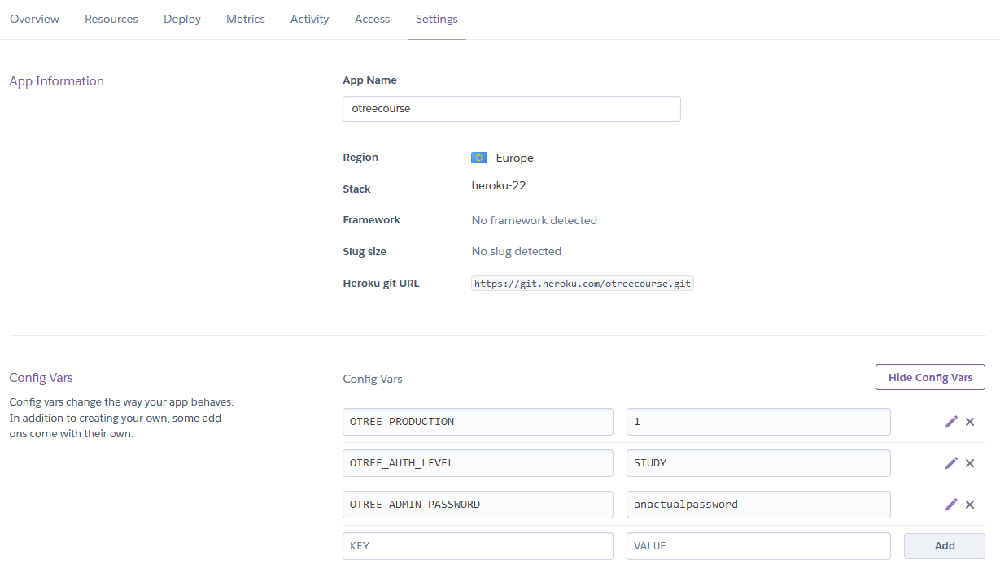
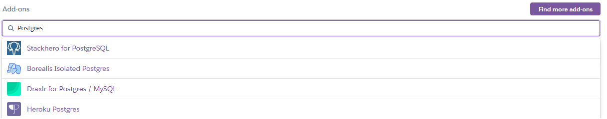
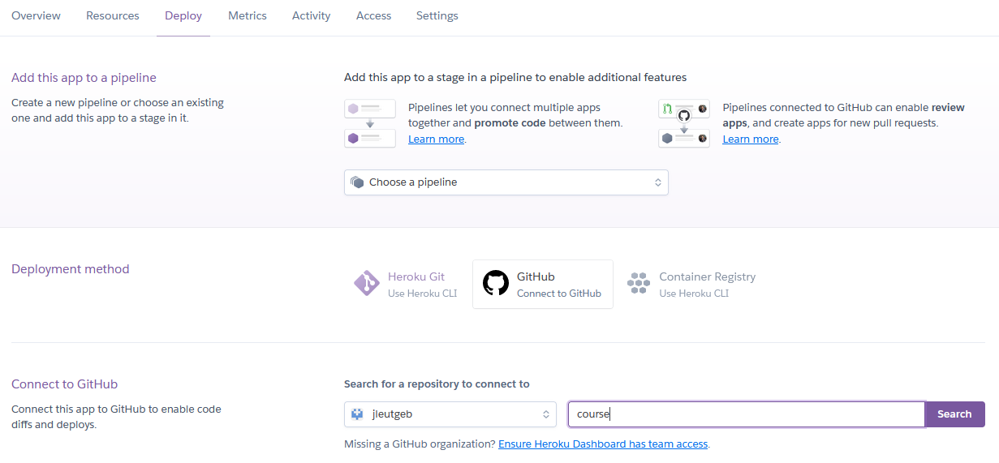
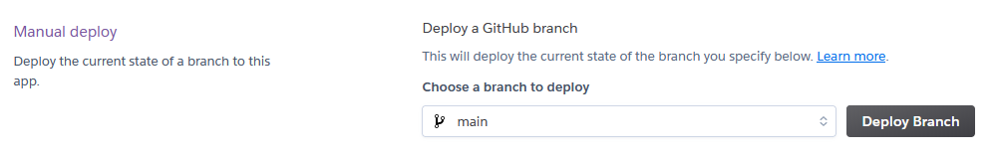
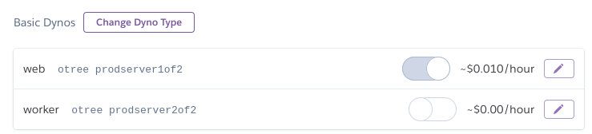

# Using the WZB heroku setup

## WZB heroku teams

There are a handful of WZB Team accounts on Heroku that are automatically billed to the WZB credit card. If you need access, talk to Nina, and she will add you to a WZB team account. **WZB is billed for the time that the server is running, so don't leave the server running if you don't need it.** The cost goes up if you use more fancy server features, so only use features that you really need. If you don't need the server any more, delete it (see at the end of the file).

## Heroku First-Time Setup

Go to heroku.com and log in. First, you need to switch to the WZB team account. Click on Personal in the top left corner and click the team that Nina added you to.

Click the button Create new app at the center of the screen.

Choose an app name and a region then click Create app. Make sure to choose the Europe region. 

Go to the Settings tab and click Reveal Config Vars. Add config vars for production mode, authentication mode and a password. 

Go to the Resources tab, locate Add-ons and search for Postgres. Select the addon Heroku Postgres. The Postgres Database is automatically set up and used by oTree.

Which version should you use for production? In the oTree forums people seem to use Standard-0 for small studies and Standard-2 for bigger ones but you should try and test yourself if you are running a big study. 

Go to the Deploy tab and choose GitHub in the Deployment method. Let heroku connect to your github account. Then you can connect to a repository in your github account. Click connect.

At the bottom of the page look for Manual Deploy. Pick the correct branch but if you are not doing anything fancy there will be only one branch (main). If you are using version control with git you can see any other branches you are using. Click Deploy Branch. 

Finally, you hopefully will get the message "Your app was successfully deployed". Click View and your experiment should be up and running. 

Finally, go back to the Resources tab. Now two Dynos (basically server processes that calculate everything in the experiment) are in the list. web is already running. The worker does not have to run if you are using an oTree>=5.0.

Now you can change the Dyno Type at the top. Click Change Dyno Type. 

Now you can choose between different plans. In the oTree forums most people seem to use a Standard 2X dyno. It is best to test the server with browser bots if you are running an online experiment with lots of simultaneous participants and/or pages.

You can access your experiment by clicking on Open app in the top right of the interface. 

## Stopping the server

If you want to stop your server temporarily, go to Settings and activate Maintenance Mode at the bottom. **You will still be billed for a server in maintenance mode!**

If you want to delete your server, click Delete app at the bottom of the Settings page. **THIS WILL DELETE ANY UNSAVED DATA ON YOUR SERVER**

## Updating the server

If you make any changes to your code, upload your changes to github. Then go to the Deploy tab, scroll down to "Manual Deploy" and click "Deploy Branch", with your preferred branch selected. **THIS WILL DELETE ANY UNSAVED DATA ON YOUR SERVER**

## Troubleshooting

If your experiment works on your machine but does not on heroku, you can look at the logs by clicking on "More" and selecting "View logs". These logs are in principle that same as the output in the terminal when programming on your own machine. 